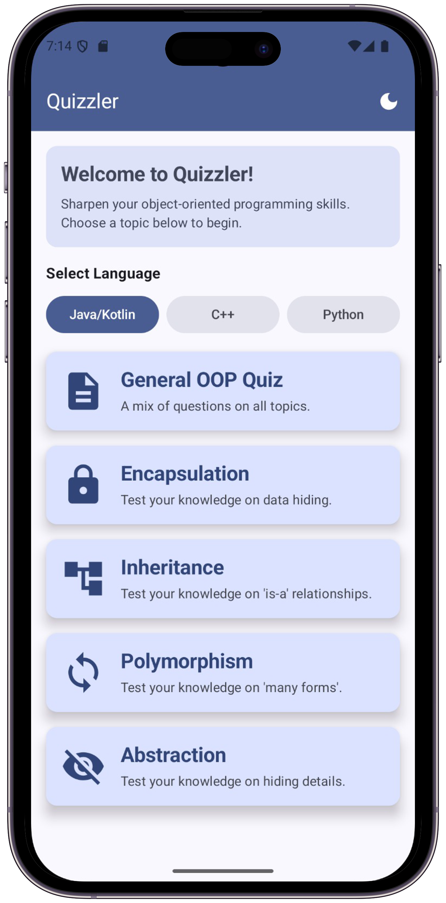
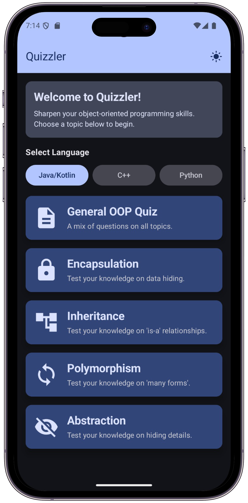
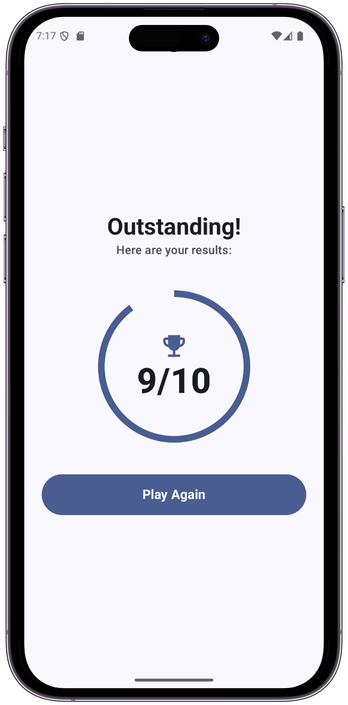

<h1 align="center">Quizzler: The OOP Learning App</h1>

<p align="center">
<a href="https://github.com/mahad2006/Quizzler-App/releases/latest"></a>
<a href="https://opensource.org/licenses/MIT"></a>
<a href="https://developer.android.com/jetpack/compose"></a>
<a href="https://kotlinlang.org/"></a>
</p>

<p align="center">
  An Android application built with Kotlin and Jetpack Compose to test and reinforce knowledge of Object-Oriented Programming principles.
</p>

---

This project was built as the final assignment for my second-semester **Object-Oriented Programming (OOP)** course. The goal wasn't just to build another quiz app, but to create a practical, hands-on demonstration of OOP concepts.

**Quizzler** is the result: a native Android application where the codebase itself is a learning resource. It's designed to showcase how principles like Abstraction, Encapsulation, Inheritance, and Polymorphism are implemented in a modern Android app using Kotlin, Jetpack Compose, and the MVVM architecture.

## 📱 Application Showcase

| Home (Light) | Home (Dark) | Quiz Feedback | Results Screen |
| :---: | :---: | :---: | :---: |
|  |  |  |  |

## ✨ Features

* **Multiple Quiz Categories:** Test your knowledge in five specific areas:
    * General OOP Concepts
    * Encapsulation
    * Inheritance
    * Polymorphism
    * Abstraction
* **Language Selection:** Choose OOP questions tailored for different languages (Java/Kotlin, C++, Python).
* **Interactive UI:** A clean and straightforward user interface built entirely with Jetpack Compose.
* **Instant Feedback:** See immediately whether your selected answer is correct or incorrect.
* **Score Tracking:** Receive a final score and a "Congratulations" message upon completing a quiz.
* **Dark/Light Theme:** Includes a toggle to switch between dark and light modes, with a dynamic theme that respects system settings.

## 🏛️ Architecture & OOP Demonstration

This project is built using **MVVM (Model-View-ViewModel)** and is structured to actively showcase the four pillars of OOP.

* **Language:** 100% **Kotlin**
* **UI Toolkit:** **Jetpack Compose** with **Material 3**
* **Architecture:** **MVVM (Model-View-ViewModel)**
* **Core Libraries:** AndroidX Lifecycle (for `ViewModel`) and Jetpack Compose

### How This Project Demonstrates OOP

1.  **Abstraction**
    * **`QuizDataSource` Interface:** This interface defines a contract for what a data source must provide (e.g., `getInheritanceQuiz()`). It hides the complexity of *where* the questions come from. The rest of the app doesn't know or care if the data is hardcoded, fetched from a local database, or downloaded from the internet.

2.  **Encapsulation**
    * **`Question` Data Class:** This class bundles the data (question text, options, correct answer) and related behavior into a single, cohesive unit. By using `val`, the data is made read-only, protecting the object's state from accidental external modification.
    * **`QuizViewModel`:** The ViewModel encapsulates all the business logic and state (the current score, question index, etc.). The UI (View) only interacts with exposed methods like `onAnswerSelected()` and observes state, without ever directly manipulating the logic itself.

3.  **Inheritance**
    * **`ViewModel` Subclassing:** Both `QuizViewModel` and `ThemeViewModel` inherit from the `androidx.lifecycle.ViewModel` class. This allows them to reuse all the lifecycle-aware functionality of the parent `ViewModel` (like surviving configuration changes) while adding their own specialized features for managing quiz and theme state. This is a classic "is-a" relationship.

4.  **Polymorphism**
    * **`QuizDataSource` Implementations:** The `QuizViewModel` is designed to work with *any* object that implements the `QuizDataSource` interface. We have `JavaQuizData`, `CppQuizData`, and `PythonQuizData`. The ViewModel can hold an object of any of these types and call the same methods (e.g., `getGeneralQuiz()`) on it, and the correct set of questions will be returned. This ability to use different object types through the same interface is a key example of polymorphism.

### Built With
<p align="center">
  
  
  
  
</p>

## 📲 Download & Installation

The latest installable `.apk` file is available on the **Releases** page.

1.  Navigate to the [**Latest Release**](https://github.com/mahad2006/Quizzler-App/releases/latest)
2.  Under **Assets**, download the `Quizzler-v1.0.0.apk` file
3.  Open it on your Android device (enable *Install from Unknown Sources* if prompted)

## 🛠️ Building from Source

Interested in building the app yourself or contributing?

1.  Clone the repository:
    ```bash
    git clone [https://github.com/mahad2006/Quizzler-App.git](https://github.com/mahad2006/Quizzler-App.git)
    ```
2.  Open the project in Android Studio (Iguana or newer).
3.  Let Gradle sync and build the project.
4.  Run on an emulator or a physical device.

## 🤝 Contributing

Contributions are welcome! If you have a feature request, bug report, or want to contribute code, please feel free to:
1.  Open an [issue](https://github.com/mahad2006/Quizzler-App/issues) to discuss the change.
2.  Fork the repository and create a new branch.
3.  Submit a pull request with your changes.

## About Me

My name is **Mahad** (`codewithmahad`), and I’m a software developer and student passionate about building practical, well-designed applications.
This project was a joy to build — combining my academic studies with my passion for mobile development.

<p align="center">
<a href="https://www.linkedin.com/in/codewithmahad"></a>
<a href="https://github.com/mahad2006"></a>
</p>

## 📜 License

This project is licensed under the **MIT License**.

---

<p align="center">
  <b>Developed with ❤️ by <a href="https://www.linkedin.com/in/codewithmahad">Shaikh Mahad</a></b> <br>
  <sub>© 2025 Quizzler — All rights reserved.</sub>
</p>
